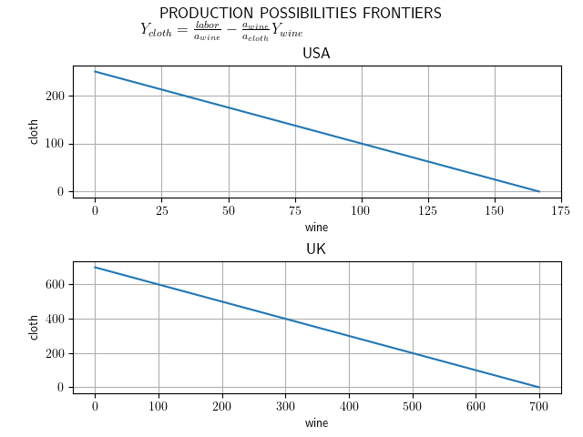
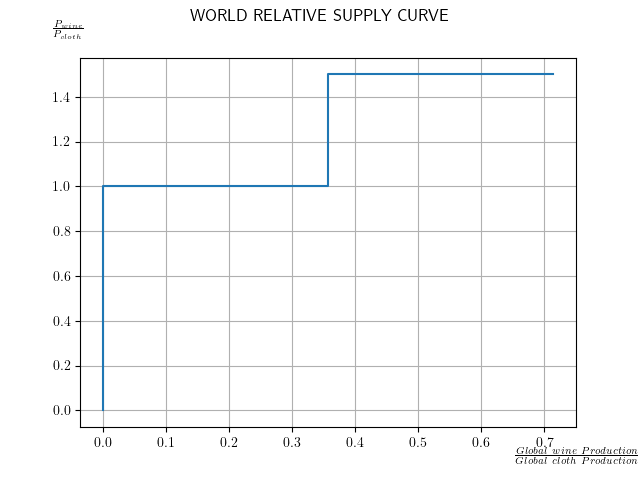

# COMS4995
# TeachTrade - international economics models made easy

[](https://travis-ci.com/github/AlexPeile/TeachTrade)
[](https://codecov.io/gh/AlexPeile/TeachTrade) 
[](https://teachtrade.readthedocs.io/en/main/)<br/> 
TeachTrade is a library of international trade models for economic education, providing tools to implement and visualize a number of neo-classical and modern models of international trade.

# Country Objects
Trade is modelled between countries, ususally only two. Country objects allow for the educator to clearly display what makes up a given country's factor endowments and production technologies, and how these affect trade in a number of economic models. Countries can be set up as follows:
```python
from international_trade_models import country, ricardian

USA_factors = {"labor": 500,
               "capital": 1000}
UK_factors = {"labor": 700,
              "capital": 200}
USA_tech = {"wine": 3,
            "cloth": 2,
            "microprocessors": 2}
UK_tech = {"wine": 1,
           "cloth": 1,
           "microprocessors": 4}
           
country_a = country.Country("USA", USA_factors, USA_tech)
country_b = country.Country("UK", UK_factors, UK_tech)
```

# Ricardian Model
The very first Neoclassical model of trade, the brain-child of David Ricardo in the late 18th century, is the first and most basic model of this library. The model assumes a world containing only two countries (home and foreign) and trading in two goods (a and b). So long as both countries have an associated productivity for each good, precisely which goods are being traded can be changed on the fly. Setting up the model requires specifying which two countries, which two goods, and which singular factor of production the model should be based on. 
Example:
```python
model = ricardian.Ricardian2C2G("wine", "cloth", "labor", country_a, country_b)
```
The Ricardian model comes with a number of useful functions and visualization tools, replicating the kinds of calculations and graphs that would be drawn in a classroom setting. These include:
- equal_autarky(): returns the aurtarky quantities each country produces of each good, assuming they seek to equalize consumption across the two.
- full_specialization(): returns each country's comparative advantage good, as well as the quantity they produce of it when fully specialized.
- ppf(): generates and visualizes a graph of the two countries' production possibilities frontiers
- rs_curve(): generates and visualizes the world relative supply curve

## PPF Example:


## RS Curve Example:

